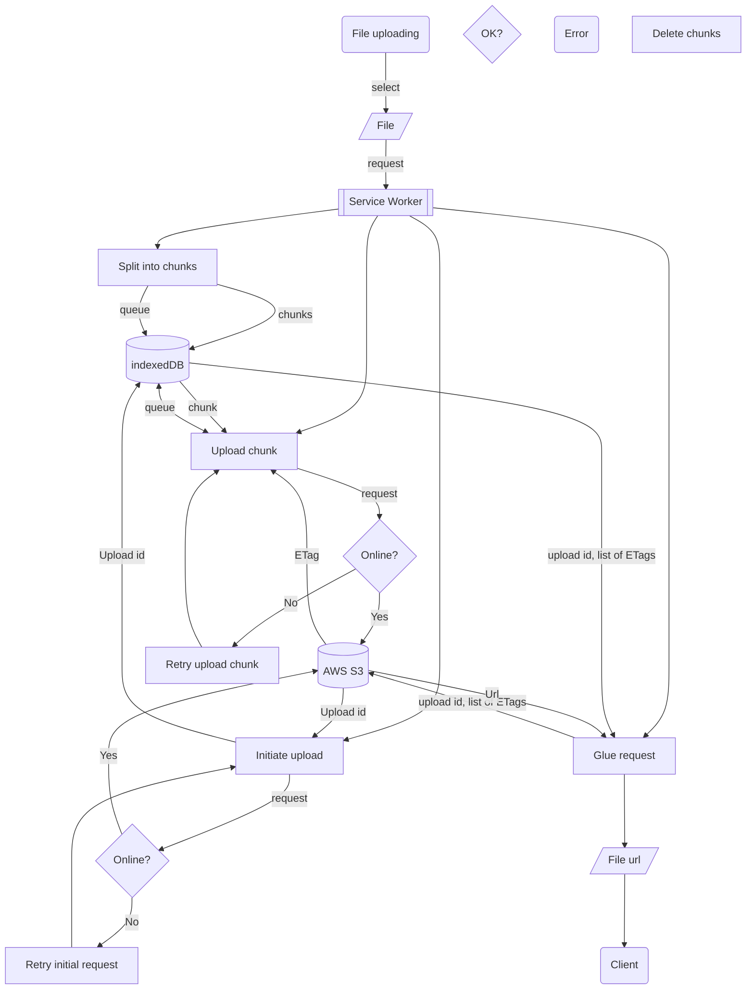

# README

This README would normally document whatever steps are necessary to get the
application up and running.

Things you may want to cover:

* Ruby version

* System dependencies

* Configuration

* Database creation

* Database initialization

* How to run the test suite

* Services (job queues, cache servers, search engines, etc.)

* Deployment instructions

* ...

# Introduction

File uploading is devided into several reqests. First, you need to make initial request to get the upload id. Then you split file into chunks (min 5MB and max 5GB, max 10000 chunks) and put each into the IndexedDB. On top of that there is uploading queue. Item in a queue means that the chunk is not uploaded yet or failed to upload. Successful chunk uploading request returns ETag which should be stored in paticular chunk item in IndexedDB. Once queue is empty, you need to send the final request with the list of all ETags to complete the upload. As a result AWS will 'glue' together all chunks and in response you will get the file url.

Since Fetch API does not support onProgress callback and [the workaround](https://stackoverflow.com/a/69400632) is supported only in Chrome, and [ServiceWorker does not support XHR](https://developer.mozilla.org/en-US/docs/Web/API/Service_Worker_API), uploading progress bar can be calculated as the file size divided by the number of chunks. For this example I used 5MB chunks. So everytime a chunk is uploaded, the progress bar is updated. This might not be the best solution for small files or/and slow internet connection.

## The following schema shows the flow of the file uploading process

# Kudos to

- Alicia Rojas and her article about [PWA for Rails](https://alicia-paz.medium.com/make-your-rails-app-work-offline-part-1-pwa-setup-3abff8666194)